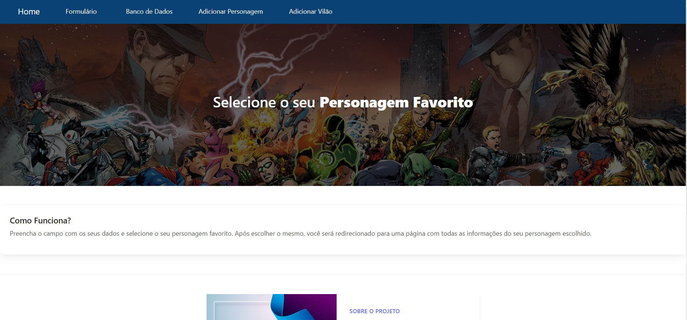

# MVC de Personagens

> Neste projeto após responder um pequeno formulário é possível editar as informações cadastrais, selecionar seu login, inserir um novo personagem e realizar comentários sobre ele.

### Ajustes e melhorias

O projeto se encontra finalizado, mas foi feita as seguintes alterações:

- [x] Visuzalizar o Banco de Dados
- [x] Realizar Alerações no Banco
- [ ] Demosntração em uma única página.

Copyright © 2023 - [Fernandeezz](https://github.com/Fernandeezz)

A permissão é concedida, gratuitamente, a qualquer pessoa que obtenha uma cópia deste arquivo, com restrição de publicar como seu repositório. Porém, sem restrição nos direitos de usar, copiar, modificar e mesclar.
